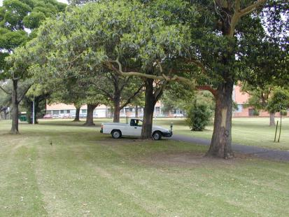
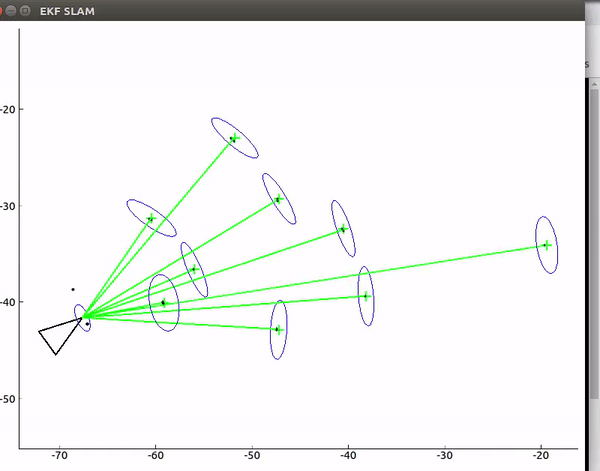

## Introduction
This project implements an Extended Kalman Filter based SLAM (Simulateneous Localization and Mapping) for the Victoria park dataset

* The dataset consists of Odometry measurements, GPS and 2D Lidar Scans.
<p align="left">
 
</p>

Refer the handout for more details.

## Results

<p align="center">
 
</p>

`key`
* The vehicle is shown as a triangle.
* The rays represent lidar measurements
* The green cross represents tree landmarks.
* The blue elipse represents their covariance

## Execution
```
python slam.py
```


